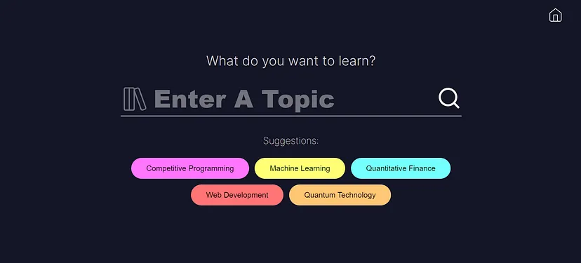
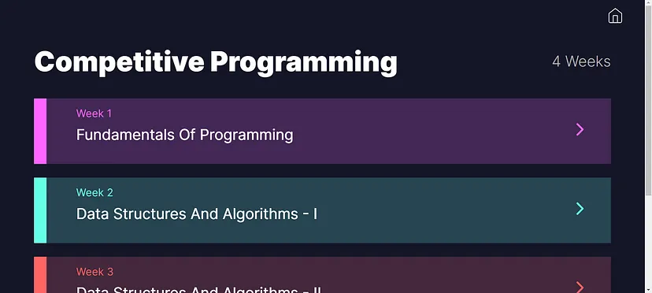
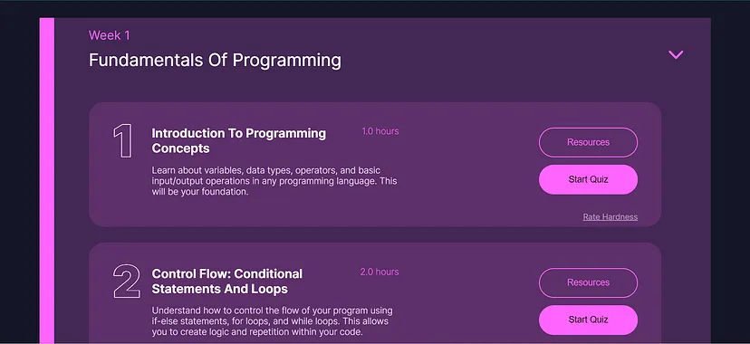

# 🧑‍💻 Learn Anything Easily With Personalized Learning Paths Using AI

Imagine a platform that gives you a detailed personalized roadmap along with resources for any topic that you want to learn, based on your individual needs, time constraints, preferable language, and current knowledge level. This is exactly what our AI-driven web based educational platform delivers.

## Installation

# AI-Powered Personalized Learning Platform

*Team Name:* Neural Nomads  
*Team Number:* 10  
*Course:* ITCS-6112 SSDI Project Deliverable  
*Document:* User Manual

---

## 🚀 Deployment / Installation Steps

### 🔧 Step 1: Install Prerequisites

Ensure the following are installed:
•⁠  ⁠Node.js and npm
•⁠  ⁠Python (preferably 3.8+)
•⁠  ⁠pip
•⁠  ⁠MongoDB (for persistent data storage)
•⁠  ⁠An OpenAI Gemini API Key (for AI-based recommendations)

---

### 🧪 Step 2: Clone the Project

⁠ bash
git clone https://github.com/manik192/learning_path_gen.git
cd AIPersonalizedLearningPlatform
 ⁠
### Step 3: Install Frontend Dependencies
1.⁠ ⁠Open Command Prompt or PowerShell
2.⁠ ⁠Navigate to your project root folder:
⁠ bash ⁠
3.⁠ ⁠Run: 
⁠ bash
npm install
 ⁠
That installs everything needed for the frontend.

### Step 4: Set Up the Backend
1.⁠ ⁠Go into the backend folder:
⁠ bash
cd backend
 ⁠
2.⁠ ⁠Create and activate the virtual environment:
⁠ bash
# For Windows
python -m venv humanaize
.\humanaize\Scripts\activate

# For Linux/Mac
python3 -m venv humanaize
source humanaize/bin/activate
 ⁠
3.⁠ ⁠Install backend dependencies:
⁠ bash
pip install -r requirements.txt
 ⁠
### Step 5: Create .env File
In the backend folder, create a file named .env with this content:
⁠ bash
GEMINI_API_KEY=YOUR_GEMINI_API_KEY
 ⁠
Replace YOUR_GEMINI_API_KEY with your actual API key from Google’s Gemini/PaLM.
### Step 6: Start the Backend
Still inside backend and with the virtual env active, run:
⁠ bash
npm run backend
 ⁠
### Step 7: Start the Frontend
1.⁠ ⁠Open a new terminal window.
2.⁠ ⁠Go back to your frontend root:
⁠ bash
cd AI-Powered-Personalized-Learning-System
 ⁠
3.⁠ ⁠Start the frontend:
⁠ bash
npm start
 ⁠
## What Exactly will this Platform do?
We are creating a web based platform, where users can get personalized roadmaps along with resources to learn something new. The platform will also track and visualize progress of the user.

The Users will provide a topic which they want to learn. Along with the topic they can also provide the time they have to learn it, preferable language, and the knowledge level they have.

Generative AI will be incorporated to create roadmaps, schedules and quizzes along with expected time to complete topics. Along with it resources will be recommended using a smart data and API based system. Depending on quizzes and feedback the roadmap will be dynamically personalized. The progress will be tracked and visualized in the platform.

## How will it Work?
The flow of the solution can be understood by the following simplified user flow diagram

